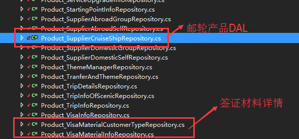
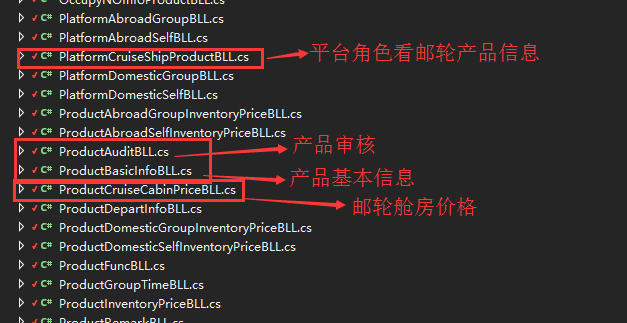

# 1. 邮轮管理

## 1.1 `基础数据`管理

### 1.1.1 页面位置

菜单：[基础数据] - [邮轮管理]

### 1.1.2 代码

#### 1.1.2.1 控制器

* CruisShipController.cs - 邮轮公司信息
* CruisShipInfoController.cs - 邮轮公司属下邮轮信息
* CruisShipSailController.cs - 邮轮航程信息

#### 1.1.2.2 视图

#### 1.1.2.3 WCF DAL

> \\FD.TradingCenter.SQLServerDAL\\ResourceData

#### 1.1.2.4 DB Schema

#### 1.1.2.5 WCF BLL

> \\FD.TradingCenter.BLL\\FD.TradingCenter.BLL.ResourceDataManager

* CabinTypeOfCruiseShipBLL（舱房类型）
* CruiseShipInfoBLL（邮轮信息） CruiseShipCompanyBLL（邮轮公司信息）
* DeckOfCruiseShipBLL（甲板） DestinationCruiseBLL（航程目的地）
* EntertainmentFacilityBLL（娱乐设施）
* EntertainmentFacilityTypeBLL（邮轮娱乐设施类型） HouseTypeOfCruiseShipBLL（房型）
* RestaurantBLL（餐厅） RestaurantTypeBLL（餐厅类型）
* SailDetailOfCruiseShipBLL（航程详情）
* SailOfCruiseShipBLL（航程信息）
* SailTypeOfCruiseShipBLL（航线类型）

## 1.2 `途经目的地`与`主题`管理

> `途经目的地`与`主题`用于前台检索产品

### 1.2.1 页面位置

* 菜单：[基础数据] - [主题管理]

* 途径目的地与主题在新增产品与编辑产品时添加，（出境与国内产品途径目的地区域分级不同），页面位置：

### 1.2.2 代码

#### 1.2.2.1 控制器

#### 1.2.2.2 视图
* 主题管理配置页面：

* 途径目的地与主题使用页面；
view文件位于新增产品与编辑产品第一个tab页，邮轮产品view文件位置：
（该图片展示为编辑页面，详情页面未展示）

#### 1.2.2.3 WCF DAL

#### 1.2.2.4 DB Schema

* Product_TranferAndTheme表中以type字段值区分类型：（0：主题 1：国家 2：省份、州 3：城市
4：区、县 ）

#### 1.2.2.5 WCF BLL

# 2.邮轮产品管理
## 2.1 `邮轮产品`管理
### 2.1.1 邮轮产品新增与编辑页面位置

### 2.1.2 代码
#### 2.1.2.1 控制器

* 邮轮产品新增页面点击保存基本信息后会跳转产品编辑页面，此同其他产品逻辑。（ps：
  邮轮产品此前新增与编辑逻辑分开，控制器与view不同。）

  

#### 2.1.2.2 视图

#### 2.1.2.3 WCF DAL

> \\FD.TradingCenter.SQLServerDAL\\Product

#### 2.1.2.4 DB Schema

#### 2.1.2.5 WCF BLL
>\\FD.TradingCenter.BLL\\FD.TradingCenter.BLL.ProductManager

# 3.订单管理
## 3.1 `邮轮下单`管理
### 3.1.1 邮轮订单下单页面位置
略过。

### 3.1.2 代码
#### 3.1.2.1 控制器
>\\Controllers\\Order\\OrderFront(各产品下单页面控制器所在文件夹)\\CruiseOrderPlacedController

#### 3.1.2.2 视图
>\\Views\\Order\\OrderFront\\CruiseOrderPlaced

#### 3.1.2.3 WCF DAL
>\\FD.TradingCenter.SQLServerDAL\\Orders\\Order_CruisePlacedRepository

1.Order_VerifyCruiseShipExtentionReposition 核对房型价格表信息
2.Order_VerifyCruiseShipManagementCostsReposition 邮轮管理费核对信息
* 其余为公用部分：

1.Order_MessageInfoReposition 留言信息
2.Order_RemarkInfoReposition 备注信息
3.Order_TouristInfoReposition 游客信息
4.Order_UpgradeServiceInfoReposition 升级服务（邮轮为线路价格信息）
5.Order_VerifyItemInfoReposition 核对附加项信息
6.Order_VerifyTouristInfoReposition 核对游客信息
7.Order_VerifyUpgradeServiceInfoReposition 升级服务核对信息
8.Order_VerifyVisaInfoReposition 签证信息核对信息
8.Order_AbroadOrderExtentionReposition 出境签证信息
#### 3.1.2.4 DB Schema

*  邮轮下单页面木有 订单自定义附加项（Order_AgentItemInfo
），但有一个功能相同的Order_CruiseAddtionItemInfoRepository（表为Order_CruiseAddtionItemInfo）
此为供应商确认邮轮订单时可以追加的附加金额项。只有邮轮如此。
#### 3.1.2.5 WCF BLL
>\\FD.TradingCenter.BLL\\FD.TradingCenter.BLL.OrderManager\\OrderCruisePlacedBLL(
邮轮下单主要逻辑即在从文件中)
其他相关文件如下：

* OrderMessageBLL 订单留言
* OrderRedPackageBLL 订单红包
* OrderRemarkInfoBLL 订单备注
* OrderServiceUpgradeBLL 升级服务
* OrderTouristInfoBLL 游客信息
* OrderVerifyCruiseOrderExtentionBLL 核对房型
* OrderVerifyItemInfoBLL 核对项
* OrderVerifyTouristInfoBLL 游客核对信息
* OrderVerifyUpgradeServiceInfoBLL 升级服务核对信息
* OrderVerifyVisaInfoBLL 签证核对
* Order_CruiseOrderExtentionBLL 房型信息
* OrderAbroadOrderExtentionBLL 签证信息

## 3.2 `邮轮订单管理`
### 3.2.1 订单管理页面位置
略。
### 3.2.2 订单管理代码
#### 3.2.2.1 控制器
>\\Controllers\\Order\\OrderManagement\\CruiseOrder\\

#### 3.2.2.2 视图
>\\Views\\Order\\OrderManagement\\CruiseOrder\\

* ps：其他平台角色页面命名规则同上。
* ps: 现在改为只能供应商发起核对，然后订单转态进入核对中，组团社可查看，并进行“同意核对”
和“重新核对”的操作。

#### 3.2.2.3 WCF DAL
>\\FD.TradingCenter.SQLServerDAL\\Orders\\

1. Order_AgencyCruiseManageRepository
2. Order_SupplierCruiseManageRepository
3. Order_PlatformCruiseManageRepository

#### 3.2.2.4 DB Schema
无。
#### 3.2.2.5 WCF BLL
>\\FD.TradingCenter.BLL\\FD.TradingCenter.BLL.OrderManager\\

1. OrderAgencyCruiseManageBLL 组团社订单管理BLL
2. OrderSupplierCruiseManageBLL 供应商订单管理BLL
3. OrderPlatformCruiseManageBLL 平台订单管理BLL

## 3.3 `订单管理检索面板`（所有产品模式一致)
### 3.3.1 页面位置：

* 订单检索条件使用model位于 `\\FD.TradingCenter.Model\\Orders\\OrderQueryRequest.cs`
ps：所有平台订单管理检索、导出皆使用此类文件。相关处理代码逻辑也存在于此文件中。

### 3.3.2 处理逻辑
* 以组团社邮轮订单为例（其他产品各平台逻辑同此）

# 4.组团社个人中心

## 4.1 `组团社个人中心`
### 4.1.1 页面位置：

### 4.1.2 代码部分：
#### 4.1.2.1 控制器

#### 4.1.2.2 视图

#### 4.1.2.3 WCF 端代码

# 5.组团社注册协议
* 页面位置：

* ps:
 1. 目前需求是组团社新注册用户需要同意两份合作协议（国内和出境），系统会在平台审核组团社资质并审核通过时自动生成四份PDF格式协议（2016国内、2016出境、2017国内、2017出境）。并可在平台查看和下载，组团社可在个人中心-合作协议页面查看和下载。协议一经生成不能修改删除。
 2. 之前已经通过审核的组团社，需要在登录成功跳转首页时弹出“同意以上协议”的弹框，用户不点击同意不进行其他操作。点击同意后，后台会自动生成四份PDF格式协议，此同平台审核。
 3. 当协议有效期截止时，同第二条，会在组团社登录成功进入首页时弹框重新使其点击“同意以上协议”的弹框。之后重新生成协议。
 4. 暂时未做确认的需求：
 1> 进入17年进行的操作是否依然需要自动生成16年的两份协议。
 2> 自动生成的协议是否自动生成本年及次年的两份协议（配置中可控制，目前默认是当年及次年）

* WEB端代码

* DB结构

# --------分割线 END 分割线（大体如此，谢谢。）--------
